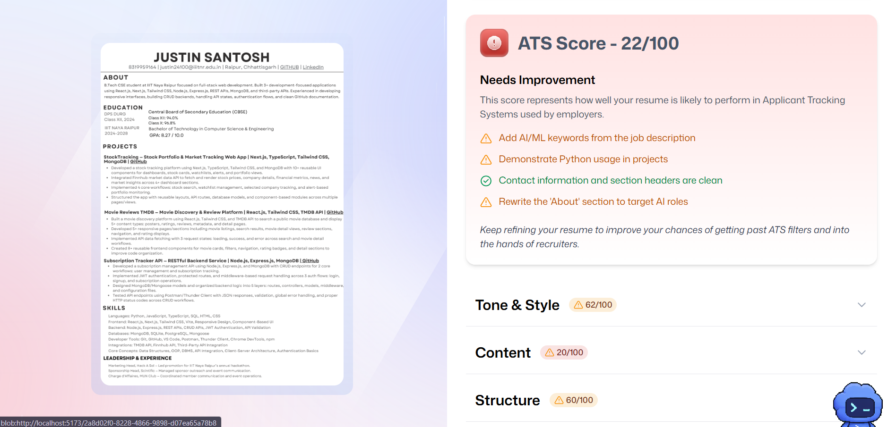
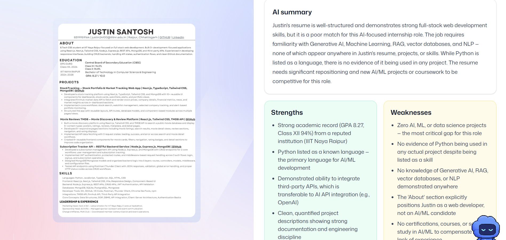
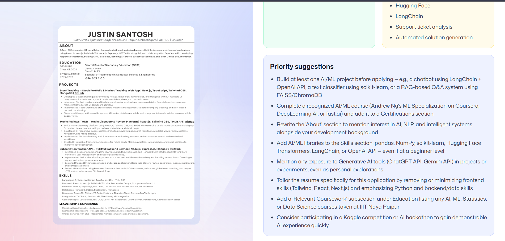

# AI Resume Analyzer

Resumind is a browser-only resume analyzer built with React 19, React Router 7,
TypeScript, Tailwind CSS 4, Zustand, PDF.js, and Puter.js. Users authenticate,
upload a PDF resume, compare it with a job description, receive structured ATS
feedback, and revisit previous analyses without operating a backend.

## Run locally

Requirements: Node.js 20+ and npm.

```bash
npm install
npm run dev
```

Open `http://localhost:5173`. Puter.js supplies authentication, AI, file storage,
and key-value persistence; no API key or environment file is required.

## Product screenshots

### ATS score and category breakdown



### AI summary, strengths, and weaknesses



### Priority recommendations



## Validate

```bash
npm run typecheck
npm run build
```

## Architecture

The dependency direction is:

```text
Routes and components -> hooks -> services -> repositories -> Puter adapter
```

Puter records use `resume:{id}`, `analysis:{id}`, and `history:{userId}`. The
history record is the only dashboard index, so the app never scans unrelated
keys. Uploaded PDFs and generated previews are private to the authenticated
Puter user.

## Credits

The initial visual workflow and tutorial assets are based on
[Adrian Hajdin's AI Resume Analyzer](https://github.com/adrianhajdin/ai-resume-analyzer).
The application logic and production-oriented architecture in this repository
were implemented against the specifications in this project.
